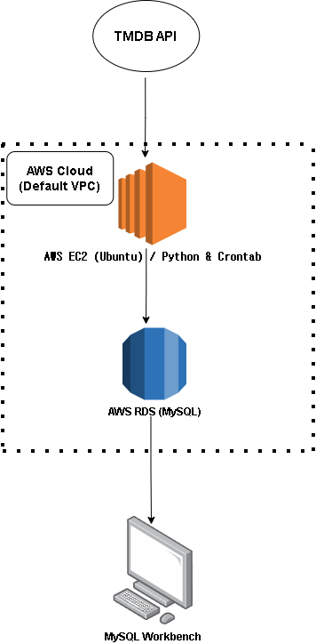

# 🎬 AWS 클라우드 기반 TMDB 영화 데이터 자동 수집 파이프라인

기존에 진행했던 영화 정보 API(TMDB)에서 최신 영화 데이터를 가져오는 프로젝트를 **AWS 클라우드 환경에 적용함으로써 영화 데이터를 자동으로 수집하고 데이터베이스에 저장**하는 자동화 프로젝트입니다.


## 📌 1. 프로젝트를 만든 이유
* **목표**: 매일 직접 코드를 실행하지 않아도, 클라우드가 알아서 영화 데이터를 수집하고 저장하는 시스템을 경험해보기 위해 구축했습니다.
* **배경**: 자격증(AWS SAA, SQLD 등)공부를 통해 스스로 배운 클라우드와 데이터베이스 이론을 실제로 나만의 프로젝트로 적용해보고자 진행했습니다.


## 🛠️ 2. 사용한 기술과 전체 구조

* **언어**: Python (데이터 가져오기 및 가공)
* **데이터베이스**: AWS RDS - MySQL (영화 데이터 저장소)
* **가상 서버**: AWS EC2 - Ubuntu Linux (24시간 켜져 있는 클라우드 컴퓨터)
* **자동화**: Linux Crontab (정해진 시간에 코드를 실행해주는 스케줄러)

### 🏗️ 데이터 흐름도 (Architecture)
1. **[TMDB API]**: 최신 영화 정보 원천 데이터
2. ➔ **[AWS EC2 가상 서버]**: 매일 새벽 3시, 파이썬 코드가 자동으로 작동하여 데이터 수집 및 정제
3. ➔ **[AWS RDS 데이터베이스]**: 깨끗하게 정리된 데이터를 클라우드 DB에 적재
4. ➔ **[MySQL Workbench / SQL Analysis]**: 적재된 데이터를 바탕으로 영화 평점 및 장르 분석




## 🚀 3. 핵심 구현 내용

1. **24시간 작동하는 클라우드 가상 서버(EC2) 구축**
   * 내 컴퓨터를 끄더라도 항상 켜져 있는 AWS EC2 리눅스 서버를 준비했습니다.
   * 리눅스의 `crontab` 기능을 활용해 매일 새벽 3시마다 수집 프로그램이 스스로 실행되도록 자동 설정했습니다.

2. **클라우드 데이터베이스(RDS) 구축 및 보안 통신**
   * AWS RDS(MySQL)를 만들어 영화, 장르, 감독 데이터를 저장할 테이블들을 설계했습니다.
   * RDS 데이터베이스에 아무나 접근하지 못하도록, 내가 만든 EC2 가상 서버만 들어올 수 있게 보안 문(보안 그룹)을 열어주었습니다.

3. **데이터 수집 및 정제 (Python)**
   * API에서 가져온 영화 데이터를 파이썬(`pandas`)으로 다듬어 DB 규격에 맞게 변환 후 적재했습니다.

---

## 🔍 4. 프로젝트 중 만난 문제와 해결 과정 (트러블슈팅)

### 🚨 문제 1: 가상 서버에서 데이터베이스로 접속이 안 되는 현상
* **상황**: EC2 가상 서버에 코드를 올리고 실행했더니 데이터베이스에 연결할 수 없다는 에러(`Can't connect to MySQL server`)가 떴습니다.
* **원인**: RDS 데이터베이스가 보안을 위해 외부 접근을 전부 차단하고 있어서, 새로 만든 EC2 서버의 접근까지 막고 있었습니다.
* **해결**: RDS의 보안 설정(보안 그룹)에 "이 EC2 가상 서버의 접근은 허용한다"라는 인바운드 규칙을 추가해 통로를 열어주었습니다.

### 🚨 문제 2: 파이썬 데이터를 데이터베이스에 넣을 때 타입 에러 발생
* **상황**: 파이썬으로 가공한 데이터를 DB에 밀어 넣으려 할 때 `numpy.int64 cannot be converted` 에러 및 `NaN` 에러가 발생했습니다.
* **원인**: 
  1. 데이터 가공 라이브러리(Pandas)가 사용하는 특수한 숫자 타입(`numpy.int64`)을 MySQL 연결 프로그램이 순수 숫자로 인식하지 못했습니다.
  2. 영화 정보 중 비어있는 값(`NaN`)이 DB에 전달될 때 형태가 맞아떨어지지 않았습니다.
* **해결**: 데이터를 파이썬의 가장 순수한 기본 형태(리스트/튜플)로 재변환하고, 비어있는 값(`NaN`)은 데이터베이스의 빈 값인 `NULL`로 바꾸어 들어가도록 코드를 보완했습니다.

---

## 📊 5. 적재된 데이터로 SQL 분석해보기

테이블 생성 및 분석 쿼리는 기존에 진행했던 프로젝트에 포함되어 있는 쿼리들로 진행했습니다.
아래에 있는 쿼리는 그 중 하나로, 데이터베이스에 모인 최신 영화 데이터를 바탕으로 실행해본 간단한 SQL 분석 쿼리입니다.

```sql
-- 장르별 영화 수와 평균 평점 분석
SELECT 
    g.name AS 장르,
    COUNT(mg.movie_id) AS 영화수,
    ROUND(AVG(m.rating), 2) AS 평균평점
FROM genres g
JOIN movie_genres mg ON g.genre_id = mg.genre_id
JOIN movies m ON mg.movie_id = m.movie_id
GROUP BY g.genre_id, g.name
HAVING 영화수 >= 5
ORDER BY 평균평점 DESC;
